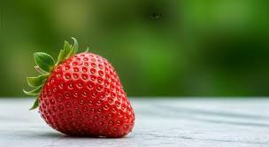

# H1
## H2
### H3

***text***

* A
* B
* C
    * c1
    * c2
        * cc

1. one
2. two
    * df

[Link](https://www.figma.com/deck/JpQ414xJ5UAgsKVt5Mf1Fa/git-github--2?node-id=63-229&t=1YsoZRzulwhpAHnl-0&scaling=min-zoom&content-scaling=fixed&page-id=0%3A1)



`Code`

```js
const x = 10;
```

```cpp
int x = 10;
```

---
***
___

</br>
</br>
</br>

<p style="color:red"><b>RED</b></p>


```py
x = 10
```

> How are you